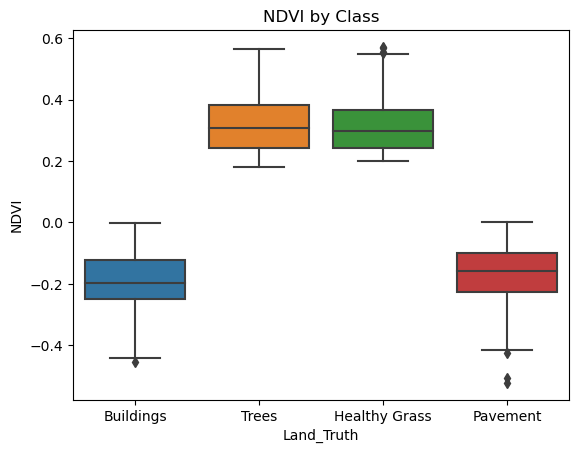
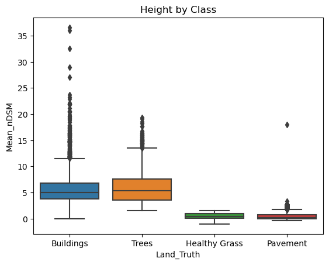
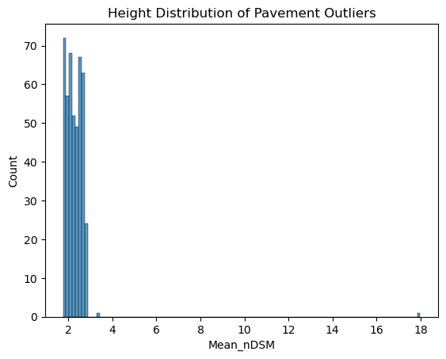
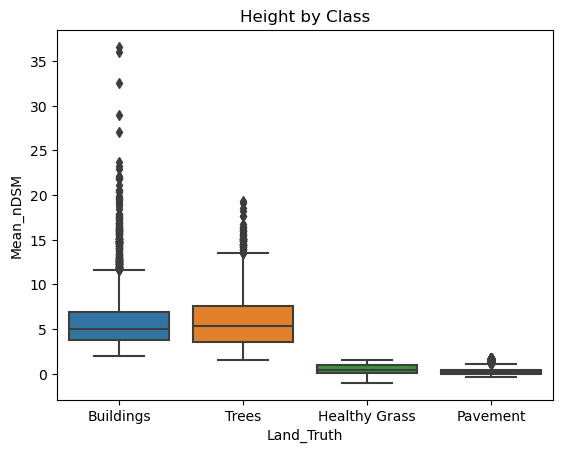
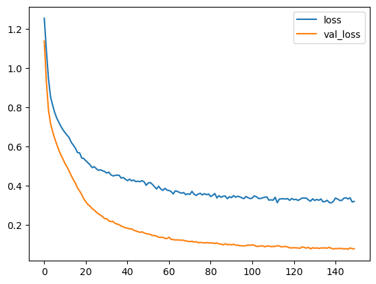

### Introduction
This is a continuation of my master's capstone project I conducted in late 2021. Please see paper on the topic here. The input data for that project consisted of seven land cover dataframes holding many different spectral properties. These land cover types were derived from classified objects using an OBIA workflow conducted in eCognition software. The workflow consisted of segmenting and classifying the spectral and height properties from imagery and auxillary DEM data. NAIP 4-band imagery and a normalized digital surface model (built in ArcGIS) were used of Boulder, CO. An accuracy assessment of the classification revealed an average rate of 90% for each land cover type. 

With this said, the label data for *this* project is not 100% accurate. Therefore, there should be some discretion used when assessing the general performance. Ultimately, an extensive ground-truth sample would be preferred.

The main objective of this project was to test how a multi-class DNN would perform on objects from this school project. For this, I have focused the notebook below on the standard steps in ingesting, cleaning, and building a basic DNN model, training, and evaluating the performance.


### Land Cover Types
**- Buildings**

**- Pavement**

**- Trees**

**- Healthy Grass**

Each class contained upwards of 800k objects with the following spectral metrics. These metrics will be the features used to train the neural network.
- Mean Red: Mean Red value of object
- Mean Green: Mean Green value of object
- Mean Blue: Mean Blue value of object
- Mean NIR: Mean Near-infrared of object
- Mean nDSM: Mean elevation of object
- NDVI: Vegation Indice (Mean NIR - Mean Red) / (Mean NIR + Mean Red) (i.e. proxy for impervious/pervious surfaces)
- Std. DSM: Standard deviation of elevation in object (i.e. proxy for smoothness)

For speed purposes, I have only selected 4000 records from each class. These records will be combined in a single dataframe and then used to train and test the neural network.


```python
import os
import glob
import pandas as pd
import geopandas as gpd
import numpy as np
import matplotlib.pyplot as plt
import seaborn as sns
import pickle
%matplotlib inline


all_df = pd.DataFrame()
for fi in glob.glob('Inputs/*.shp'):    
    df = gpd.read_file(os.path.abspath(fi))
    sample = df.loc[:, ['Land_Truth', 
                        'Mean_Red', 
                        'Mean_Green', 
                        'Mean_Blue', 
                        'Mean_NIR', 
                        'Mean_nDSM', 
                        'NDVI', 
                        'sd_dsm']].sample(4000)
    
    all_df = pd.concat([all_df, sample])
   

# shuffle dataframe
all_df = all_df.sample(frac=1).reset_index(drop=True)
all_df.head()
```

<div>
<style scoped>
    .dataframe tbody tr th:only-of-type {
        vertical-align: middle;
    }

    .dataframe tbody tr th {
        vertical-align: top;
    }

    .dataframe thead th {
        text-align: right;
    }
</style>
<table border="1" class="dataframe">
  <thead>
    <tr style="text-align: right;">
      <th></th>
      <th>Land_Truth</th>
      <th>Mean_Red</th>
      <th>Mean_Green</th>
      <th>Mean_Blue</th>
      <th>Mean_NIR</th>
      <th>Mean_nDSM</th>
      <th>NDVI</th>
      <th>sd_dsm</th>
    </tr>
  </thead>
  <tbody>
    <tr>
      <th>0</th>
      <td>Buildings</td>
      <td>170.275510</td>
      <td>157.928571</td>
      <td>131.938776</td>
      <td>111.326531</td>
      <td>3.601077</td>
      <td>-0.209334</td>
      <td>1.318128</td>
    </tr>
    <tr>
      <th>1</th>
      <td>Trees</td>
      <td>68.782258</td>
      <td>84.596774</td>
      <td>69.387097</td>
      <td>173.693548</td>
      <td>2.769680</td>
      <td>0.432667</td>
      <td>2.363513</td>
    </tr>
    <tr>
      <th>2</th>
      <td>Healthy Grass</td>
      <td>74.171429</td>
      <td>83.028571</td>
      <td>70.200000</td>
      <td>147.000000</td>
      <td>0.735676</td>
      <td>0.329286</td>
      <td>1.151501</td>
    </tr>
    <tr>
      <th>3</th>
      <td>Pavement</td>
      <td>145.727273</td>
      <td>133.363636</td>
      <td>122.727273</td>
      <td>102.545455</td>
      <td>0.022228</td>
      <td>-0.173929</td>
      <td>0.051500</td>
    </tr>
    <tr>
      <th>4</th>
      <td>Pavement</td>
      <td>116.121951</td>
      <td>119.414634</td>
      <td>116.804878</td>
      <td>75.658537</td>
      <td>0.251256</td>
      <td>-0.210988</td>
      <td>0.507209</td>
    </tr>
  </tbody>
</table>
</div>


### Exploratory Data Analysis
The following creates a few figures to highlight some of the main distinctions between impervious and pervious surfaces. This distinction is very important when combined with the Mean nDSM attribute which can then further delineate each class. 


```python
sns.boxplot(data=all_df, x='Land_Truth', y='NDVI')
plt.title('NDVI by Class')

```
 

    


```python
sns.boxplot(data=all_df, x='Land_Truth', y='Mean_nDSM')
plt.title('Height by Class')
```
 

    


### Clean Data
Based on the above figures we see a few distinctions. First off, both impervious classes (buildings, pavement) have low NDVI values, whereas pervious(grass, trees) have high NDVI values. This makes sense as vegetation reflect more NIR whereas man-made structures reflect more Red. 

Secondly, height (elevation) for each class intutively makes sense: Buildings and Trees are much taller, whereas Pavement and Healthy Grass have values at or around 0-meters. Buildings primarily consist of heights around 5 to 7 meter with a large collection of outliers ranging upward of 40-meters. This makes sense as much of the imagery consist of residental neighborhoods with regular sized homes (5-7 meters or 15-20 feet), and a small downtown area containing much taller buildings. 

It's important to note that the Pavement class has a small colleciton of outliers with heights around 5-meters. This may be incorrect values and something that could be removed to give a better represenation of the class. These particular outliers could be objects that were not segmented quite well and could contain a mixture of other classes. 

**Identify the relatively high nDSM values in the Pavement class**

From a look of the distribution of the Mean_nDSM metric, we can see that the marjority of the values (75%) are within 0.73 meters. To find the group of outliers we can use the traditional definition of an outlier which is IQR * 1.5. Since are outliers are all high, then the calculation would be Q3 + IQR*1.5


```python
pavement_stats = all_df[all_df['Land_Truth'] == 'Pavement'].describe(percentiles=[.25,.5,.75,.9]).T
pavement_stats
```

<div>
<style scoped>
    .dataframe tbody tr th:only-of-type {
        vertical-align: middle;
    }

    .dataframe tbody tr th {
        vertical-align: top;
    }

    .dataframe thead th {
        text-align: right;
    }
</style>
<table border="1" class="dataframe">
  <thead>
    <tr style="text-align: right;">
      <th></th>
      <th>count</th>
      <th>mean</th>
      <th>std</th>
      <th>min</th>
      <th>25%</th>
      <th>50%</th>
      <th>75%</th>
      <th>90%</th>
      <th>max</th>
    </tr>
  </thead>
  <tbody>
    <tr>
      <th>Mean_Red</th>
      <td>4000.0</td>
      <td>150.387076</td>
      <td>27.138330</td>
      <td>58.938053</td>
      <td>128.131448</td>
      <td>151.993007</td>
      <td>172.658046</td>
      <td>185.684904</td>
      <td>219.000000</td>
    </tr>
    <tr>
      <th>Mean_Green</th>
      <td>4000.0</td>
      <td>146.046759</td>
      <td>27.228277</td>
      <td>65.473451</td>
      <td>123.994444</td>
      <td>146.369048</td>
      <td>167.184436</td>
      <td>182.636675</td>
      <td>216.250000</td>
    </tr>
    <tr>
      <th>Mean_Blue</th>
      <td>4000.0</td>
      <td>139.730006</td>
      <td>27.138152</td>
      <td>72.042035</td>
      <td>119.493416</td>
      <td>137.914545</td>
      <td>158.000000</td>
      <td>177.768485</td>
      <td>216.666667</td>
    </tr>
    <tr>
      <th>Mean_NIR</th>
      <td>4000.0</td>
      <td>109.853907</td>
      <td>30.261047</td>
      <td>36.373894</td>
      <td>85.562355</td>
      <td>106.314286</td>
      <td>134.491279</td>
      <td>152.421863</td>
      <td>206.166667</td>
    </tr>
    <tr>
      <th>Mean_nDSM</th>
      <td>4000.0</td>
      <td>0.551719</td>
      <td>0.788938</td>
      <td>-0.329121</td>
      <td>0.033971</td>
      <td>0.195804</td>
      <td>0.724106</td>
      <td>1.870215</td>
      <td>17.983565</td>
    </tr>
    <tr>
      <th>NDVI</th>
      <td>4000.0</td>
      <td>-0.165541</td>
      <td>0.077975</td>
      <td>-0.521859</td>
      <td>-0.227684</td>
      <td>-0.157618</td>
      <td>-0.099734</td>
      <td>-0.072051</td>
      <td>0.002335</td>
    </tr>
    <tr>
      <th>sd_dsm</th>
      <td>4000.0</td>
      <td>0.678583</td>
      <td>0.735593</td>
      <td>0.000000</td>
      <td>0.086232</td>
      <td>0.450639</td>
      <td>1.023442</td>
      <td>1.756214</td>
      <td>5.950402</td>
    </tr>
  </tbody>
</table>
</div>


```python
PAVEMENT_Q3 = pavement_stats.loc['Mean_nDSM', '75%']
PAVEMENT_Q1 = pavement_stats.loc['Mean_nDSM', '25%']	
OUTLIER_PAVEMENT = PAVEMENT_Q3 + ((PAVEMENT_Q3 - PAVEMENT_Q1)*1.5)

# locate outliers
pavement_outlier = all_df[(all_df['Land_Truth'] == 'Pavement') & 
       (all_df['Mean_nDSM'] >= (OUTLIER_PAVEMENT))]

print(pavement_outlier['Mean_nDSM'].describe().T)
```

    count    454.000000
    mean       2.304387
    std        0.800281
    min        1.759774
    25%        2.001235
    50%        2.276442
    75%        2.539732
    max       17.983565
    Name: Mean_nDSM, dtype: float64
    


```python
# histogram to show distribution of the Pavement Outliers
sns.histplot(pavement_outlier['Mean_nDSM'])
plt.title('Height Distribution of Pavement Outliers')
```
   

    


It is important to ensure each labelled class has clear and distinct characteristics. Since the whole thing clearly differentiating Pavement from the Buildings class is the Mean_nDSM attribute it is important to ensure values do not overlap from each class.

The next step will be to look at the low end of heights in the Buildings Mean_nDSM distribution and identify a threshold to use for the Pavement class. Conversely, Buildings that overlap in height (i.e. within 2 std (75%)) should be removed. 

I have chosen to drop these outliers. In some cases, it may be smarter to reclassify these objects. 


```python
all_df[all_df['Land_Truth'] == 'Buildings'].describe().T

```


<div>
<style scoped>
    .dataframe tbody tr th:only-of-type {
        vertical-align: middle;
    }

    .dataframe tbody tr th {
        vertical-align: top;
    }

    .dataframe thead th {
        text-align: right;
    }
</style>
<table border="1" class="dataframe">
  <thead>
    <tr style="text-align: right;">
      <th></th>
      <th>count</th>
      <th>mean</th>
      <th>std</th>
      <th>min</th>
      <th>25%</th>
      <th>50%</th>
      <th>75%</th>
      <th>max</th>
    </tr>
  </thead>
  <tbody>
    <tr>
      <th>Mean_Red</th>
      <td>4000.0</td>
      <td>149.255051</td>
      <td>29.590927</td>
      <td>100.034014</td>
      <td>124.716667</td>
      <td>147.230952</td>
      <td>172.043756</td>
      <td>223.531250</td>
    </tr>
    <tr>
      <th>Mean_Green</th>
      <td>4000.0</td>
      <td>145.519586</td>
      <td>30.639503</td>
      <td>74.833333</td>
      <td>121.001437</td>
      <td>142.053977</td>
      <td>167.939516</td>
      <td>227.543478</td>
    </tr>
    <tr>
      <th>Mean_Blue</th>
      <td>4000.0</td>
      <td>140.681078</td>
      <td>33.216099</td>
      <td>70.270270</td>
      <td>115.296875</td>
      <td>135.000000</td>
      <td>163.300183</td>
      <td>229.739130</td>
    </tr>
    <tr>
      <th>Mean_NIR</th>
      <td>4000.0</td>
      <td>105.520783</td>
      <td>35.334896</td>
      <td>41.669492</td>
      <td>77.800164</td>
      <td>97.704793</td>
      <td>127.005952</td>
      <td>210.438017</td>
    </tr>
    <tr>
      <th>Mean_nDSM</th>
      <td>4000.0</td>
      <td>5.825133</td>
      <td>3.092533</td>
      <td>0.002874</td>
      <td>3.736427</td>
      <td>5.028741</td>
      <td>6.862039</td>
      <td>36.604897</td>
    </tr>
    <tr>
      <th>NDVI</th>
      <td>4000.0</td>
      <td>-0.186150</td>
      <td>0.087308</td>
      <td>-0.452847</td>
      <td>-0.250000</td>
      <td>-0.196420</td>
      <td>-0.122261</td>
      <td>-0.000438</td>
    </tr>
    <tr>
      <th>sd_dsm</th>
      <td>4000.0</td>
      <td>1.468801</td>
      <td>1.149948</td>
      <td>0.004944</td>
      <td>0.643029</td>
      <td>1.201237</td>
      <td>2.003143</td>
      <td>13.494210</td>
    </tr>
  </tbody>
</table>
</div>


```python
PAVEMENT_90PERCENTILE = pavement_stats.loc['Mean_nDSM', '90%']

bad_pavement = all_df[(all_df['Land_Truth'] == 'Pavement') &
       (all_df['Mean_nDSM'] >= OUTLIER_PAVEMENT)]


bad_buildings = all_df[(all_df['Land_Truth'] == 'Buildings') &
       (all_df['Mean_nDSM'] <= PAVEMENT_90PERCENTILE)]

all_bad = pd.concat([bad_pavement, bad_buildings])
all_df_clean = all_df.drop(all_bad.index)
```


```python
sns.boxplot(data=all_df_clean, x='Land_Truth', y='Mean_nDSM')
plt.title('Height by Class')
```
  

    


The figure above, shows a better delineation of each class after removing some of the outliers in the Pavement class and reducing the lower-Quartile of the Buildings class to ensure minimal overlap. 

### Model Development
Deep Neural Network using a rectified linear unit for the activation function. This will be a mutually exclusive multi-classification model. For this, labels need to be converted to dummy variables. 

**- Healthy Grass = 0** 

**- Trees = 1**

**- Pavement = 2**

**- Buildings = 3**


```python
# convert labels (Land Truth to integers)
def convert_labels(x):
    if x == 'Healthy Grass':
        return 0
    elif x == 'Trees':
        return 1
    elif x == 'Pavement':
        return 2
    else:
        return 3 # Buildings

all_df_clean['Class'] = all_df_clean['Land_Truth'].apply(lambda x: convert_labels(x))
all_df_clean = all_df_clean.drop('Land_Truth', axis=1)
all_df_clean.head(1)
```


<div>
<style scoped>
    .dataframe tbody tr th:only-of-type {
        vertical-align: middle;
    }

    .dataframe tbody tr th {
        vertical-align: top;
    }

    .dataframe thead th {
        text-align: right;
    }
</style>
<table border="1" class="dataframe">
  <thead>
    <tr style="text-align: right;">
      <th></th>
      <th>Mean_Red</th>
      <th>Mean_Green</th>
      <th>Mean_Blue</th>
      <th>Mean_NIR</th>
      <th>Mean_nDSM</th>
      <th>NDVI</th>
      <th>sd_dsm</th>
      <th>Class</th>
    </tr>
  </thead>
  <tbody>
    <tr>
      <th>0</th>
      <td>170.27551</td>
      <td>157.928571</td>
      <td>131.938776</td>
      <td>111.326531</td>
      <td>3.601077</td>
      <td>-0.209334</td>
      <td>1.318128</td>
      <td>3</td>
    </tr>
  </tbody>
</table>
</div>


```python
from sklearn.model_selection import train_test_split
```

Features have been split at a 70/30 ratio
- 70% for Training
- 30% for Testing


```python
X = all_df_clean.drop('Class',axis=1).values # features
y = all_df_clean['Class'].values # labels
X_train, X_test, y_train, y_test = train_test_split(X, y, test_size=0.30, random_state=10)
```

### Normalize Data
Normalizing is required if features are of different units. Here I have used a basic MinMax which transforms each value between 0 and 1, while perserving the intra-relationship (ratios) of features.


```python
from sklearn.preprocessing import MinMaxScaler
```


```python
scaler = MinMaxScaler()
X_train = scaler.fit_transform(X_train) # only fit to traning data!
X_test = scaler.transform(X_test) # transform 
```

### Create and compile model
The model's first layer has 7 neurons since there are 7 features. For simplicity's sake I've only included one hidden layer that contains about half the nuerons in the first layer. The last layer uses a softmax function since this is a multi-classificaiton model. 


```python
import tensorflow as tf
from tensorflow.keras.models import Sequential
from tensorflow.keras.layers import Dense, Activation,Dropout
from tensorflow.keras.constraints import max_norm
```


```python
model = Sequential()

# input layer
model.add(Dense(8,  activation='relu'))
model.add(Dropout(0.2))

# hidden layer
model.add(Dense(5, activation='relu'))
model.add(Dropout(0.2))

# output layer
model.add(Dense(4,activation='softmax'))

# Compile model
model.compile(loss='sparse_categorical_crossentropy', optimizer='adam')
```

### Train Model


```python
from tensorflow.keras.callbacks import EarlyStopping
```


```python
early_stop = EarlyStopping(monitor='val_loss', mode='min', verbose=1, patience=25)
```


```python
model.fit(x=X_train, 
          y=y_train, 
          epochs=150,
          batch_size=100,
          validation_data=(X_test, y_test), 
          verbose=1,
          callbacks=[early_stop]
          )
```

    Epoch 1/150
    109/109 [==============================] - 1s 4ms/step - loss: 1.2548 - val_loss: 1.1382
    Epoch 2/150
    109/109 [==============================] - 0s 2ms/step - loss: 1.0929 - val_loss: 0.9333
    Epoch 3/150
    109/109 [==============================] - 0s 3ms/step - 

    **[ ... ]**

### Evaluate Model 


```python
# Learning Rate
losses = pd.DataFrame(model.history.history)
losses[['loss','val_loss']].plot()
```


    


```python
from sklearn.metrics import classification_report,confusion_matrix
```

### Predictions on test


```python
predictions = model.predict(X_test)
```

    146/146 [==============================] - 0s 1ms/step
    


```python
predictions = np.argmax(predictions, axis=1)
```


```python
from sklearn.metrics import classification_report,confusion_matrix
```


```python
print('Confusion Matrix')
print(confusion_matrix(y_test,predictions))
```

    Confusion Matrix
    [[1222    2    0    0]
     [  32 1182    0    0]
     [   1    0 1056    9]
     [   0    0    8 1141]]
    


```python
print(classification_report(y_test,predictions))
```

                  precision    recall  f1-score   support
    
               0       0.97      1.00      0.99      1224
               1       1.00      0.97      0.99      1214
               2       0.99      0.99      0.99      1066
               3       0.99      0.99      0.99      1149
    
        accuracy                           0.99      4653
       macro avg       0.99      0.99      0.99      4653
    weighted avg       0.99      0.99      0.99      4653
    
    


```python
# test model on a new input
sample = all_df.sample(1)
sample
```


<div>
<style scoped>
    .dataframe tbody tr th:only-of-type {
        vertical-align: middle;
    }

    .dataframe tbody tr th {
        vertical-align: top;
    }

    .dataframe thead th {
        text-align: right;
    }
</style>
<table border="1" class="dataframe">
  <thead>
    <tr style="text-align: right;">
      <th></th>
      <th>Land_Truth</th>
      <th>Mean_Red</th>
      <th>Mean_Green</th>
      <th>Mean_Blue</th>
      <th>Mean_NIR</th>
      <th>Mean_nDSM</th>
      <th>NDVI</th>
      <th>sd_dsm</th>
    </tr>
  </thead>
  <tbody>
    <tr>
      <th>5777</th>
      <td>Trees</td>
      <td>55.378788</td>
      <td>62.257576</td>
      <td>62.0</td>
      <td>83.80303</td>
      <td>6.29295</td>
      <td>0.204224</td>
      <td>5.021595</td>
    </tr>
  </tbody>
</table>
</div>


```python
sample_prediction = model.predict(sample.drop(['Land_Truth'], axis=1))
sample_prediction = np.argmax(sample_prediction, axis=1)
sample_prediction
```

    1/1 [==============================] - 0s 94ms/step
    


    array([1], dtype=int64)


```python
# Save model for later use
with open('obia_ml_tensor1.pkl', 'wb') as f:
    pickle.dump(model, f)
```


```python

```
